# Polyglot Codebase Knowledge Graph

> Generated offline by **readmenator**. Supports C, C++, Python, Go, Rust, JS/TS, Java, C#, Shell, PHP, Dart, GDScript, Nim, ASM.
> No LLMs. No tokens. Pure static analysis.

**Total Files Parsed:** 2 | **Total Symbols Extracted:** 13 | **Total Imports:** 8

## Structural Knowledge Map

```mermaid
graph TD
    classDef mod fill:#1e1e1e,stroke:#ff6666,stroke-width:2px,color:#fff;
    classDef cls fill:#2d2d2d,stroke:#4ec9b0,stroke-width:2px,color:#fff;
    classDef fn fill:#333,stroke:#dcdcaa,stroke-width:1px,color:#dcdcaa;
    classDef ext fill:#111,stroke:#666,stroke-dasharray: 5 5,color:#aaa;
    app_py["app.py (py)"]
    class app_py mod;
    app_py_EncodeDecodeForm["EncodeDecodeForm"]
    class app_py_EncodeDecodeForm cls;
    app_py --> app_py_EncodeDecodeForm
    app_py_index["index"]
    class app_py_index fn;
    app_py --> app_py_index
    app_py_add_security_headers["add_security_headers"]
    class app_py_add_security_headers fn;
    app_py --> app_py_add_security_headers
    lazyencoder_decoder_py["lazyencoder_decoder.py (py)"]
    class lazyencoder_decoder_py mod;
    lazyencoder_decoder_py_base64_encode["base64_encode"]
    class lazyencoder_decoder_py_base64_encode fn;
    lazyencoder_decoder_py --> lazyencoder_decoder_py_base64_encode
    lazyencoder_decoder_py_base64_decode["base64_decode"]
    class lazyencoder_decoder_py_base64_decode fn;
    lazyencoder_decoder_py --> lazyencoder_decoder_py_base64_decode
    lazyencoder_decoder_py_caesar_cipher["caesar_cipher"]
    class lazyencoder_decoder_py_caesar_cipher fn;
    lazyencoder_decoder_py --> lazyencoder_decoder_py_caesar_cipher
    lazyencoder_decoder_py_caesar_decipher["caesar_decipher"]
    class lazyencoder_decoder_py_caesar_decipher fn;
    lazyencoder_decoder_py --> lazyencoder_decoder_py_caesar_decipher
    lazyencoder_decoder_py_key_substitution["key_substitution"]
    class lazyencoder_decoder_py_key_substitution fn;
    lazyencoder_decoder_py --> lazyencoder_decoder_py_key_substitution
    ext_os["os"]
    class ext_os ext;
    app_py -.->|imports| ext_os
    ext_flask["flask"]
    class ext_flask ext;
    app_py -.->|imports| ext_flask
    ext_flask_wtf["flask_wtf"]
    class ext_flask_wtf ext;
    app_py -.->|imports| ext_flask_wtf
    ext_wtforms["wtforms"]
    class ext_wtforms ext;
    app_py -.->|imports| ext_wtforms
    ext_wtforms_validators["wtforms.validators"]
    class ext_wtforms_validators ext;
    app_py -.->|imports| ext_wtforms_validators
    ext_flask_bootstrap["flask_bootstrap"]
    class ext_flask_bootstrap ext;
    app_py -.->|imports| ext_flask_bootstrap
    ext_lazyencoder_decoder["lazyencoder_decoder"]
    class ext_lazyencoder_decoder ext;
    app_py -.->|imports| ext_lazyencoder_decoder
    ext_base64["base64"]
    class ext_base64 ext;
    lazyencoder_decoder_py -.->|imports| ext_base64
```

---

## Architecture Reference

### PY (2 files)

#### `app.py`
**Path:** `app.py`

**Classs:**
- `EncodeDecodeForm` (line 9)

**Functions:**
- `index` (line 24)
- `add_security_headers` (line 46)

#### `lazyencoder_decoder.py`
**Path:** `lazyencoder_decoder.py`

**Functions:**
- `base64_encode` (line 3)
- `base64_decode` (line 6)
- `caesar_cipher` (line 10)
- `caesar_decipher` (line 23)
- `key_substitution` (line 26)
- `key_substitution_reverse` (line 41)
- `encode` (line 56)
- `encode_string` (line 67)
- `decode` (line 73)
- `decode_string` (line 84)
