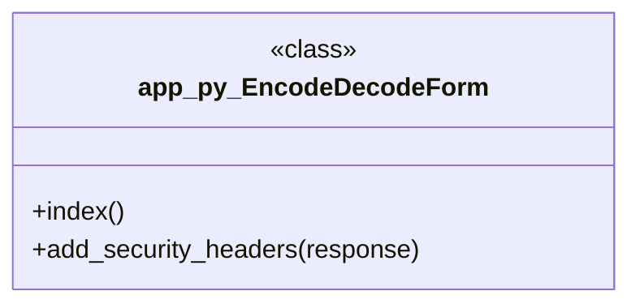

# Polyglot Codebase Knowledge Graph

> Generated offline by **readmenator**. 2 files, 13 symbols, 8 imports. Supports C, C++, Python, Go, Rust, JS/TS, Java, C#, Shell, PHP, Dart, GDScript, Nim, ASM, Ruby, Swift, Kotlin, Scala, Lua, Elixir.
> No LLMs. No tokens. Pure static analysis. See more [here](https://github.com/grisuno/ReadMenator)

**Start here:** Statistics Dashboard for scope, God Nodes for blast radius, Architecture Reference for per-file API. Agents: prefer `readmenator-agent/INDEX.md` + `SYMBOLS.md`.

**Wiki:** prefer `readmenator-wiki/index.md` for progressive disclosure: one synthesis page per community, `connections.json` with EXTRACTED vs INFERRED confidence, `queries.md` log, `REPORT.md` audit.

**Confidence:** EXTRACTED = parsed from source, INFERRED = heuristic bridge, AMBIGUOUS = reported, never hidden. See `readmenator-wiki/REPORT.md`.

**Total Files Parsed:** 2 | **Total Symbols Extracted:** 13 | **Total Imports:** 8
 | **Resolved Imports:** 1

<!-- ranking_model: v1.0 | weights: {ppr:0.45,auth:0.2,test:0.15,doc:0.1,fresh:0.1} | alpha:0.85 | commit:1e0fd0b | date:2026-07-18 -->


## Table of Contents

1. [Statistics Dashboard](#statistics-dashboard)
2. [Architectural Layers](#architectural-layers)
3. [Ranked Context](#ranked-context)
4. [God Nodes](#god-nodes)
5. [Community Analysis](#community-analysis)
6. [Suggested Questions](#suggested-questions)
7. [Hotspot Analysis](#hotspot-analysis)
8. [Change Impact Analysis](#change-impact-analysis)
9. [Suggested Linting Rules](#suggested-linting-rules)
10. [Concept Graph](#concept-graph)
11. [Orphans](#orphans)
12. [Query Recipes](#query-recipes)
13. [Structural Knowledge Map](#structural-knowledge-map)
14. [UML Class Diagram](#uml-class-diagram)
15. [Code Property Graph](#code-property-graph)
16. [Architecture Reference](#architecture-reference)
    - [PY (2 files)](#py-2-files)

---

## Statistics Dashboard

| Metric | Value |
|--------|-------|
| Total Files | 2 |
| Total Symbols | 13 |
| Total Imports | 8 |
| Call Edges | 95 |
| Inheritance Edges | 1 |
| Languages | 1 |
| Avg Symbols/File | 6.5 |
| Avg Imports/File | 4.0 |
| Resolved Imports | 1 |

### Top Files by Import Count (Fan-Out)

| File | Imports | Symbols | Language |
|------|---------|---------|----------|
| `app.py` | 7 | 3 | py |
| `lazyencoder_decoder.py` | 1 | 10 | py |

---

## Architectural Layers

Auto-detected from path patterns, naming conventions, and imported frameworks.

| Layer | Files |
|-------|-------|
| presentation | 1 |
| utility | 1 |

### presentation

- `app.py` (py, 3 symbols)

### utility

- `lazyencoder_decoder.py` (py, 10 symbols)

---

## Ranked Context

Files ranked by composite score for the current query context. The ranking combines Personalized PageRank (query relevance), global authority, test coverage, documentation coverage, and code freshness. Model: v1.0.

| Rank | File | Composite | PPR | Authority | Test | Doc |
|------|------|-----------|-----|-----------|------|-----|
| 1 | `lazyencoder_decoder.py` | 0.4219 | 0.6491 | 0.6491 | 0.00 | 0.00 |
| 2 | `app.py` | 0.2281 | 0.3509 | 0.3509 | 0.00 | 0.00 |

---

## God Nodes

Most architecturally central files ranked by combined import/export degree and symbol richness.

| File | Score | Connections | PageRank |
|------|-------|-------------|----------|
| `lazyencoder_decoder.py` | 3.0 | | 0.6491 |
| `app.py` | 2.3 | | 0.3509 |

---

## Community Analysis

Files grouped by import-based community detection. Cohesion measures how tightly connected each community is internally.

### root (Cohesion: 1.00)

**2 files** in this community:

- `app.py` (py, 3 symbols)
- `lazyencoder_decoder.py` (py, 10 symbols)

---

## Suggested Questions

Auto-generated exploration prompts based on graph structure:

- What does lazyencoder_decoder.py depend on, and what depends on it? (1 connections)
- What does app.py depend on, and what depends on it? (1 connections)
- What is EncodeDecodeForm in app.py and how is it used?
- What is the overall architecture of this codebase?

---

## Hotspot Analysis

Files ranked by combined complexity (symbol count) and centrality (connection count). High-scoring files are architecturally critical and may need refactoring attention.

| File | Complexity | Centrality | Combined | Symbols | Connections |
|------|-----------|------------|----------|---------|-------------|
| `lazyencoder_decoder.py` | 1.000 | 0.250 | 0.550 | 10 | 2 |
| `app.py` | 0.300 | 1.000 | 0.720 | 3 | 8 |

---

## Concept Graph

Semantic second-brain layer: nouns are concept nodes, verbs are edges. Each noun maps atomically to a file set (EXTRACTED); each verb aggregates structural imports, calls, and inherits into consumes, invokes, extends, depends_on, or bridges (INFERRED).

**2 concepts, 2 relations.**

| Concept | Files | Mentions |
|---------|-------|----------|
| `decode` | 2 | 4 |
| `encode` | 2 | 4 |

### Verb Edges

| Source | Verb | Target | Strength | Evidence |
|--------|------|--------|----------|----------|
| `decode` | `depends_on` | `encode` | 1.00 | 1 |
| `encode` | `depends_on` | `decode` | 1.00 | 1 |

### Dialectic Prompts

- Thesis: `decode` centralizes 2 files; Antithesis: `encode` pulls 2 files with 2 shared (Jaccard 1.00); Synthesis: should they merge, split by layer, or keep `depends_on` explicit?

---

## Change Impact Analysis

Files sorted by how many other files would be affected if they changed. High-impact files should be changed with caution.

| File | Direct Dependents | Transitive Dependents | Total Impact |
|------|------------------|----------------------|--------------|
| `lazyencoder_decoder.py` | 1 | 0 | 1 |
| `app.py` | 0 | 0 | 0 |

---

## Suggested Linting Rules

Automatically suggested linting and security rules based on patterns detected in the codebase. These can be exported as Semgrep rules using the `--export-rules` flag.

| Rule ID | Severity | Description | Language | Matches |
|---------|----------|-------------|----------|---------|
| `RM001` | info | Large number of functions in py: 12 total | py | 12 |

---

## Orphans

Files with no documentation or low connectivity. These are candidates for documentation investment or cleanup.

- `lazyencoder_decoder.py` (10 symbols, no doc)
- `app.py` (3 symbols, no doc)

---

## Query Recipes

Example queries you can run against this knowledge base using the ranking engine:

```
# Find files most relevant to a concept
readmenator query "Where is the import resolver implemented?"

# Rank files by relevance to a topic
readmenator query "How does documentation generation work?"

# Explain why a file ranks highly
readmenator query "explain readmenator/_documentation.py"

# Trace dependency paths with ranked context
readmenator query "path from CLI to exporter"
```

The ranking model uses the following signals:

- **Personalized PageRank** (45% weight): query-specific relevance via seed propagation
- **Global Authority** (20% weight): structural importance via standard PageRank
- **Test Coverage** (15% weight): fraction of symbols referenced in test files
- **Doc Coverage** (10% weight): presence of docstrings and file-level docs
- **Freshness** (10% weight): recent modification activity

Results include score decomposition and justification paths for each ranked item.

---

## Structural Knowledge Map

```mermaid
graph TD
    classDef mod fill:#1e1e1e,stroke:#ff6666,stroke-width:2px,color:#fff;
    classDef cls fill:#2d2d2d,stroke:#4ec9b0,stroke-width:2px,color:#fff;
    classDef fn fill:#333,stroke:#dcdcaa,stroke-width:1px,color:#dcdcaa;
    classDef ext fill:#111,stroke:#666,stroke-dasharray:5 5,color:#aaa;
    subgraph community_0 ["root"]
    app_py["app.py (py)"]
    class app_py mod;
    app_py_EncodeDecodeForm["EncodeDecodeForm"]
    class app_py_EncodeDecodeForm cls;
    app_py --> app_py_EncodeDecodeForm
    app_py_index["index"]
    class app_py_index fn;
    app_py --> app_py_index
    app_py_add_security_headers["add_security_headers"]
    class app_py_add_security_headers fn;
    app_py --> app_py_add_security_headers
    lazyencoder_decoder_py["lazyencoder_decoder.py (py)"]
    class lazyencoder_decoder_py mod;
    lazyencoder_decoder_py_base64_encode["base64_encode"]
    class lazyencoder_decoder_py_base64_encode fn;
    lazyencoder_decoder_py --> lazyencoder_decoder_py_base64_encode
    lazyencoder_decoder_py_base64_decode["base64_decode"]
    class lazyencoder_decoder_py_base64_decode fn;
    lazyencoder_decoder_py --> lazyencoder_decoder_py_base64_decode
    lazyencoder_decoder_py_caesar_cipher["caesar_cipher"]
    class lazyencoder_decoder_py_caesar_cipher fn;
    lazyencoder_decoder_py --> lazyencoder_decoder_py_caesar_cipher
    lazyencoder_decoder_py_caesar_decipher["caesar_decipher"]
    class lazyencoder_decoder_py_caesar_decipher fn;
    lazyencoder_decoder_py --> lazyencoder_decoder_py_caesar_decipher
    lazyencoder_decoder_py_key_substitution["key_substitution"]
    class lazyencoder_decoder_py_key_substitution fn;
    lazyencoder_decoder_py --> lazyencoder_decoder_py_key_substitution
    end
    app_py -- resolved_imports --> lazyencoder_decoder_py
    ext_os["os"]
    class ext_os ext;
    app_py -.->|imports| ext_os
    ext_flask["flask"]
    class ext_flask ext;
    app_py -.->|imports| ext_flask
    ext_flask_wtf["flask_wtf"]
    class ext_flask_wtf ext;
    app_py -.->|imports| ext_flask_wtf
    ext_wtforms["wtforms"]
    class ext_wtforms ext;
    app_py -.->|imports| ext_wtforms
    ext_wtforms_validators["wtforms.validators"]
    class ext_wtforms_validators ext;
    app_py -.->|imports| ext_wtforms_validators
    ext_flask_bootstrap["flask_bootstrap"]
    class ext_flask_bootstrap ext;
    app_py -.->|imports| ext_flask_bootstrap
    ext_lazyencoder_decoder["lazyencoder_decoder"]
    class ext_lazyencoder_decoder ext;
    app_py -.->|imports| ext_lazyencoder_decoder
    ext_base64["base64"]
    class ext_base64 ext;
    lazyencoder_decoder_py -.->|imports| ext_base64
```



---

## UML Class Diagram

Auto-generated Mermaid class diagram from parsed class-level symbols. Shows classes, structs, interfaces, traits, and their methods with inheritance and dependency relationships.



---

## Code Property Graph

Machine-readable Code Property Graph (CPG) in JSON-LD format. This block allows AI agents to parse the full structural graph without additional file reads. Compatible with GraphRAG pipelines.

```json
{"@context": "https://schema.org", "analysis": {"communities": [{"cohesion": 1.0, "id": 0, "label": "root", "size": 2}], "god_nodes": [{"node_id": "lazyencoder_decoder.py", "score": 3.0}, {"node_id": "app.py", "score": 2.3}], "surprising_connections": []}, "edges": [{"confidence": "EXTRACTED", "relation": "imports", "source": "app.py", "target": "os"}, {"confidence": "EXTRACTED", "relation": "imports", "source": "app.py", "target": "flask"}, {"confidence": "EXTRACTED", "relation": "imports", "source": "app.py", "target": "flask_wtf"}, {"confidence": "EXTRACTED", "relation": "imports", "source": "app.py", "target": "wtforms"}, {"confidence": "EXTRACTED", "relation": "imports", "source": "app.py", "target": "wtforms.validators"}, {"confidence": "EXTRACTED", "relation": "imports", "source": "app.py", "target": "flask_bootstrap"}, {"confidence": "EXTRACTED", "relation": "imports", "source": "app.py", "target": "lazyencoder_decoder"}, {"confidence": "EXTRACTED", "relation": "imports", "source": "lazyencoder_decoder.py", "target": "base64"}, {"confidence": "EXTRACTED", "relation": "resolved_imports", "source": "app.py", "target": "lazyencoder_decoder.py"}], "generator": "readmenator", "metadata": {"edge_count": 105, "file_count": 2, "language_count": 1, "symbol_count": 13}, "nodes": [{"id": "app.py", "kind": "module", "label": "app.py", "language": "py", "sha256": "5fc00e42910fc06f", "symbol_count": 3, "symbols": [{"kind": "class", "line": 9, "name": "EncodeDecodeForm", "signature": "class EncodeDecodeForm(FlaskForm)"}, {"kind": "method", "line": 24, "name": "index", "signature": "def index()"}, {"kind": "method", "line": 46, "name": "add_security_headers", "signature": "def add_security_headers(response)"}]}, {"id": "lazyencoder_decoder.py", "kind": "module", "label": "lazyencoder_decoder.py", "language": "py", "sha256": "7f203bb26a975243", "symbol_count": 10, "symbols": [{"kind": "function", "line": 3, "name": "base64_encode", "signature": "def base64_encode(data)"}, {"kind": "function", "line": 6, "name": "base64_decode", "signature": "def base64_decode(data)"}, {"kind": "function", "line": 10, "name": "caesar_cipher", "signature": "def caesar_cipher(text, shift)"}, {"kind": "function", "line": 23, "name": "caesar_decipher", "signature": "def caesar_decipher(text, shift)"}, {"kind": "function", "line": 26, "name": "key_substitution", "signature": "def key_substitution(text, key)"}, {"kind": "function", "line": 41, "name": "key_substitution_reverse", "signature": "def key_substitution_reverse(text, key)"}, {"kind": "function", "line": 56, "name": "encode", "signature": "def encode(data, shift, key)"}, {"kind": "function", "line": 67, "name": "encode_string", "signature": "def encode_string(data, shift, key)"}, {"kind": "function", "line": 73, "name": "decode", "signature": "def decode(data, shift, key)"}, {"kind": "function", "line": 84, "name": "decode_string", "signature": "def decode_string(data, shift, key)"}]}], "type": "CodePropertyGraph", "version": "1.0"}
```

---

## Architecture Reference

### PY (2 files)

#### `app.py`
**Path:** `app.py`

**Classes:**
- `EncodeDecodeForm` (line 9) `class EncodeDecodeForm(FlaskForm)`

**Methods:**
- `index` (line 24) `def index()`
- `add_security_headers` (line 46) `def add_security_headers(response)`

#### `lazyencoder_decoder.py`
**Path:** `lazyencoder_decoder.py`

**Functions:**
- `base64_encode` (line 3) `def base64_encode(data)`
- `base64_decode` (line 6) `def base64_decode(data)`
- `caesar_cipher` (line 10) `def caesar_cipher(text, shift)`
- `caesar_decipher` (line 23) `def caesar_decipher(text, shift)`
- `key_substitution` (line 26) `def key_substitution(text, key)`
- `key_substitution_reverse` (line 41) `def key_substitution_reverse(text, key)`
- `encode` (line 56) `def encode(data, shift, key)`
- `encode_string` (line 67) `def encode_string(data, shift, key)`
- `decode` (line 73) `def decode(data, shift, key)`
- `decode_string` (line 84) `def decode_string(data, shift, key)`
